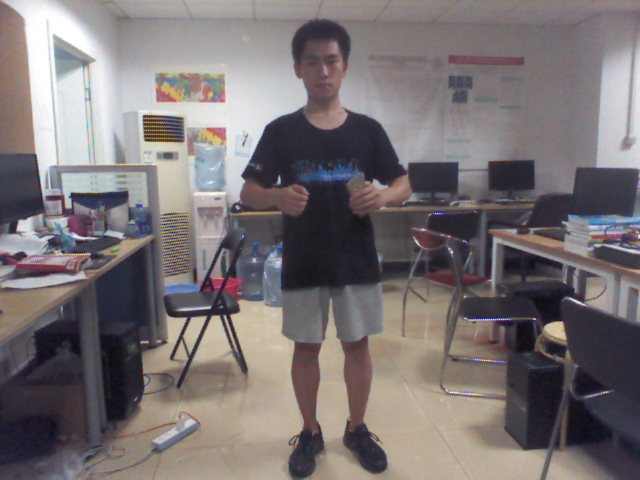

# jetInKinect: 使用Kinect 体感与语音控制鹞式战斗机
----
> Author：`杨磊`

> E-mail：`ylxx@live.com`

> Date：`2017-07-16`

> Description：use Kinect  and voice  to control jet in *GTA: San Andreas* on windows

## Demo

[](https://v.qq.com/x/page/w0528gnfxhx.html)

[Video Demo on YouTube](https://youtu.be/FVttYUcRh7w)

[Video Demo on 腾讯视频](https://v.qq.com/x/page/w0528gnfxhx.html)

## 操作说明

### 1. 身体骨骼控制部分

kinect 各节点名称


节点与节点间生成以下向量
> * spineVector：脊柱所在向量
> * shoulderVector：两个肩膀节点所在向量
> * elbowVector：两个肘关节所在向量
> * shoulderElhow：手臂的上臂向量
> * elbowWrist：手臂的前臂向量
> * hipKnee：大腿的向量
> * bodyz：由spineVector和shoulderVector叉积求得的身体平面的法向量


1. 默认状态
> 
> * `动作`：人面向Kinect 竖直战立，手臂的上臂与身体在同一平面， 手臂的前臂正对着Kinect
> * `原理`：无
>* `映射按键`：无
>* `功能`：默认状态 啥也不做

2. 垂直起飞
> 
> * `动作`：保持上臂与身体在同一平面， 前臂正对着Kinect，将上臂抬起，使之尽量与肩膀齐平
> * `原理`：计算shoulderElhowLeft 和 shoulderElhowRight的夹角 大于100°则垂直起
>* `映射按键`：`W`
>* `功能`：缓慢垂直向上升空

3. 垂直下降
> 
> * `动作`：上半身与默认状态保持一致，脚呈半蹲姿势
> * `原理`：hipKneeLeft与向量(0,0,-1)的夹角若小于80°则激发
>* `映射按键`：`S`
>* `功能`：缓慢垂直降落

4. 左倾斜/右倾斜
> 
> 
> * `动作`：保持左右手肘有较大高度落差
> * `原理`：elbowVector 和 向量(0,1,0)的角度小于75° or 大于105° 则激发
>* `映射按键`：`A/D`
>* `功能`：飞机左倾斜/右倾斜

5. 前倾斜/后倾斜
> 
> 
> * `动作`：保持前臂与水平面有较大角度
> * `原理`：elbowWrist 和 spineVector的角度小于80° or 大于120° 则激发
>* `映射按键`：`up array/down array`
>* `功能`：飞机前倾斜/后倾斜

6. 左旋转/右旋转
> 
> 
> * `动作`：上半身左/右旋转一定角度
> * `原理`：shoulderVector和 向量(0,0,1)的角度小于75° or 大于105° 则激发
>* `映射按键`：`Q/E`
>* `功能`：飞机的方向在水平左旋转/右旋转

7. 加速/减速
> 
> 
> * `动作`：前臂水平张开45°/前臂水平聚拢45°
> * `原理`：elbowWrist 和 shoulderVector 的角度小于45° or 大于135° 则激发将左右手所得的角度再进行相减 再进一步判断
>* `映射按键`：`Num8/Num2`
>* `功能`：飞机向前加速/减速


### 2. 语音控制部分

| 语音 | 映射按键  | 功能 |
| --------   | :-----:  | :----  |
| get in car| `F` | 上载具 |
| get out car| `F` | 下载具 |
| get airplane | `"jumpjet"` | 自动输入作弊码`jumpjet` 获得鹞式战斗机|
| up wheel | `2` | 收/放飞机起落架 |
| lock | `right Ctrl` | 锁定载具目标 以发射导弹 |
| flash | `right Ctrl` | 发送干扰弹 以躲避导弹 |
| radio | `r` | 切换电台 |
| fire | `Num0` | 攻击/开火/发送导弹 |

## 一些方法

### 1. 利用三维向量的角度进行体感控制
原理：

求角度公式


代码：
```python
def degreeOfVictor(p1,p2):
    dotProduct = (p1*p2).sum()
    norm = lambda p:(p**2).sum()**0.5
    angle = dotProduct/(norm(p1)*norm(p2))
    arccosDegree = lambda x:np.degrees(np.arccos(x))
    degree = arccosDegree(angle)
    return degree
 ```

优势：
> * 不随着人的身高大小，高矮胖瘦，所在位置而变化
> * 不同动作间 相互影响极小
> * 相对直接用(x,y,z)，动作的状态空间多，数据稳定

### 2. 获得上半身所在平面的法向量
原理：

　　求肩膀所在向量`a` 与脊椎所在向量`b` 的叉积即为上半身所在平面的法向量


### 3. 整合多个语音识别API 得到最佳综合结果

在开发过程中， 我详细考察了各种语音识别方案


| 方案 | 准确率 | 延迟 | 其他方面  | 评估结果 |
| --------   | :-----:   | :-----  | :----  |:----  |
| 离线方案 | 极低 | 0.5~1.5 s | 由于识别需要占用较多系统资源 会造成游戏卡顿 | 放弃 |
| 百度云语音 | 一般 | 国内网 1.7~3.0 s |  | 优先考虑 |
| 微软认知服务 | 较好 | 国内网 5~10 s |  | 可以考虑 |
| Google Cloud Platform | 较好 | IPV6代理 > 8 s |  | 可以考虑 |

最终 我将  百度云语音识别API,微软认知服务API 和 Google Cloud Platform 以**多线程**的形式进行融合

只有最先被识别的语音命令会被执行，即提高了速度，又提高了命中率

### 4. 超出3个点的点集拟合所在空间平面
原理：
> 1. 在点集中生成所有含有3个点的子集的组合
> 1. 对每一个子集生成一个平面
> 1. 将每一个平面的法向量的单位向量相加得到所求平面的法向量


## 安装指导

1. 准备一套带有电源和USB接口的 Kinect设备(最好是Kinect for Windows版本)
2. 安装Kincet SDK 1.8 ,KinectRuntime 1.8
3. 准备一个Python 2.7  **32 bit** 环境(！非常重要 KinectSDK 1.8 只支持**32 bit** Python 建议安装一个32位的Miniconda2)
4. 使用命令 `pip install -r requirements.txt` 安装所需要的包

6. 安装游戏*GTA: San Andreas*
6. 运行游戏 `gta_sa.exe`  在设置中的载具按键设置处 设置一下按键映射
原按键与新按键的映射为
```
{
        'up':'i',
        'down':'k',
        'n8':'o',
        'n2':'l',
        'rCtrl':'lAlt',
}
```
 结果如下图

6. 最后，使用命令 `python jetInKinect.py` 开启Kinect 即可操纵


## 注意事项

0. 语音控制部分同时使用了 百度云语音识别API,微软认知服务API 和 Google Cloud Platform，以同时提高速度和准确性，但准确率和网络延迟仍旧不够理想

0. 对于新手来说 就算用手柄来控制GTA中的鹞式战斗机也非常困难，所以 用身体来控制需要一定的适应期（对于熟悉用键盘开飞机的作者来说 用了半小时才熟悉）

0. 由于Kinect传感器为红外视频，所以 建议避免穿黑色衣服（黑色衣服会吸收红外线 增加传感器误差）


### 可改进事项

0. 由于程序是通过键盘映射来操作的 键盘为点按的布尔操作 ，实际上 体感更适合于类似手柄摇杆的标量操作 这将会大大提升操控体验

0. 语音识别可改为本地的预训练好的神经网络来识别

## 项目总结
　　生产实习开始时，由于微软几乎没有为`Pykinect`写文档 也缺乏参考代码，我还在考虑是使用`C#`还是`Python`来开发，最后 还是因为`numpy`和`iPython`的便利性 硬着头皮学`Pykinect`，由于微软只发布了一个pykinect的demo，所以熟悉API花费了一周多的时间

理解完API后 灵机一动 想做飞行控制，由于飞行本就十分复杂，便详细思考控制方案，最终决定 将一部分不常用事件交由语音控制

在后期`numpy`和`iPython`的便利性发挥了作用，体感数据处理得挺顺利的。后来才发现语音控制是一个坑，做了好多工作 包括查找与评估各个方案，对接各个API，多线程融合机智，但语音控制的效果仍不够理想

总之 此次Kinect开发 即有趣又有收获


## 参考
0. [PyKinect - write Kinect games using Python!](https://github.com/Microsoft/PTVS/wiki/PyKinect)
0. [向量 - 维基百科，自由的百科全书](https://zh.wikipedia.org/wiki/%E5%90%91%E9%87%8F)
0. [向量积 - 维基百科，自由的百科全书](https://zh.wikipedia.org/wiki/%E5%90%91%E9%87%8F%E7%A7%AF)
0. [Geometry Module   SymPy   documentation](http://docs.sympy.org/latest/modules/geometry/index.html#submodules)
0. [Pygame v1.9.2 documentation](http://www.pygame.org/docs/)
0. [PS/2 Keyboard - OSDev Wiki](http://wiki.osdev.org/PS/2_Keyboard)
0. [百度语音-API参考-简介-百度云](https://cloud.baidu.com/doc/SPEECH/TTS-Online-Python-SDK.html#.E8.AF.B7.E6.B1.82.E8.AF.B4.E6.98.8E)
0. [必应语音 API-认知服务试用体验 | Microsoft Azure](https://azure.microsoft.com/zh-cn/try/cognitive-services/)
0. [speech_recognition: Speech recognition module for Python, supporting several engines and APIs, online and offline.](https://github.com/Uberi/speech_recognition/)
